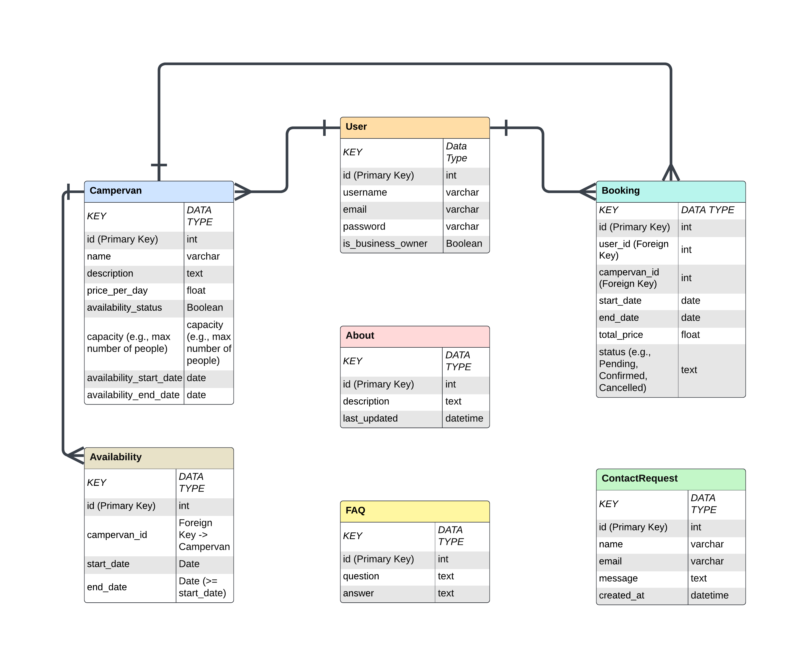

# **Wildventures**: campervan_rentals

Wildventures represents a campervan rental business. The web based booking application allows users to gather informations about the available campervans, create an account, create a booking, and then manage, edit or delete their bookings. This site was developed using Python (Django), HTML, CSS and stores data in a PostgreSQL database.

### Entity relationship diagram

This diagram shows how the users and staff users interact with the database.

## Development

### Agile Methodology

This project was developed using the Agile methodology. All epics and user stories implementation progress was tracked through Github projects Kanban Board which can be found [here](https://github.com/users/Maxcode0101/projects/5).

