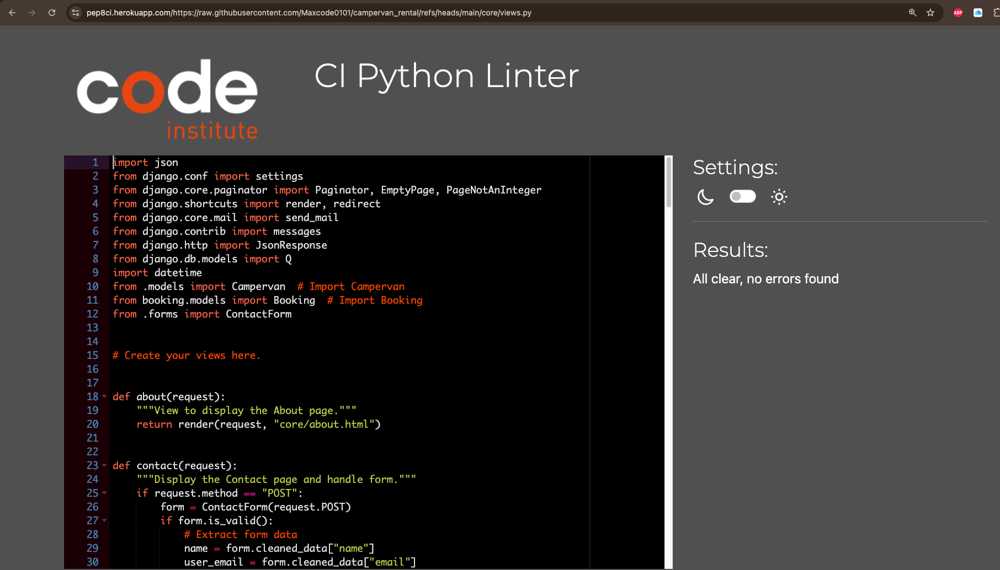
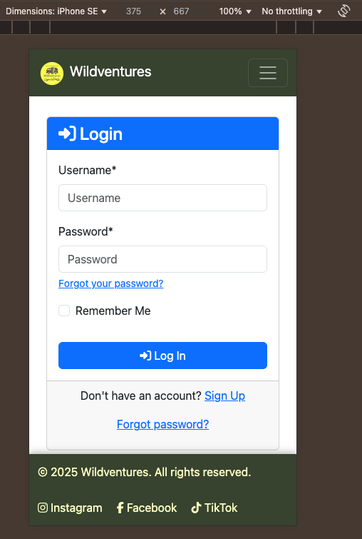

# Testing

> [!NOTE]
> Return back to the [README.md](README.md) file.

## Code Validation

### HTML

I have used the recommended [HTML W3C Validator](https://validator.w3.org) to validate all of my HTML files.

| Directory | File | URL | Screenshot | Notes |
| --- | --- | --- | --- | --- |
| booking | [book_campervan.html](https://github.com/Maxcode0101/campervan_rental/blob/main/booking/templates/booking/book_campervan.html) | Link (if applicable) |  | Notes (if applicable) |
| booking | [booking_confirmation.html](https://github.com/Maxcode0101/campervan_rental/blob/main/booking/templates/booking/booking_confirmation.html) | Link (if applicable) |  | Notes (if applicable) |
| booking | [booking_details.html](https://github.com/Maxcode0101/campervan_rental/blob/main/booking/templates/booking/booking_details.html) | Link (if applicable) |  | Notes (if applicable) |
| booking | [change_requests.html](https://github.com/Maxcode0101/campervan_rental/blob/main/booking/templates/booking/change_requests.html) | Link (if applicable) |  | Notes (if applicable) |
| booking | [edit_booking.html](https://github.com/Maxcode0101/campervan_rental/blob/main/booking/templates/booking/edit_booking.html) | Link (if applicable) |  | Notes (if applicable) |
| booking | [payment_cancel.html](https://github.com/Maxcode0101/campervan_rental/blob/main/booking/templates/booking/payment_cancel.html) | Link (if applicable) |  | Notes (if applicable) |
| booking | [payment_success.html](https://github.com/Maxcode0101/campervan_rental/blob/main/booking/templates/booking/payment_success.html) | Link (if applicable) |  | Notes (if applicable) |
| booking | [request_date_change.html](https://github.com/Maxcode0101/campervan_rental/blob/main/booking/templates/booking/request_date_change.html) | Link (if applicable) |  | Notes (if applicable) |
| core | [about.html](https://github.com/Maxcode0101/campervan_rental/blob/main/core/templates/core/about.html) | Link (if applicable) |  | Notes (if applicable) |
| core | [availability_results.html](https://github.com/Maxcode0101/campervan_rental/blob/main/core/templates/core/availability_results.html) | Link (if applicable) |  | Notes (if applicable) |
| core | [campervan_list.html](https://github.com/Maxcode0101/campervan_rental/blob/main/core/templates/core/campervan_list.html) | Link (if applicable) |  | Notes (if applicable) |
| core | [contact.html](https://github.com/Maxcode0101/campervan_rental/blob/main/core/templates/core/contact.html) | Link (if applicable) |  | Notes (if applicable) |
| core | [faq.html](https://github.com/Maxcode0101/campervan_rental/blob/main/core/templates/core/faq.html) | Link (if applicable) |  | Notes (if applicable) |
| users | [dashboard.html](https://github.com/Maxcode0101/campervan_rental/blob/main/users/templates/users/dashboard.html) | Link (if applicable) |  | Notes (if applicable) |
| users | [my_bookings.html](https://github.com/Maxcode0101/campervan_rental/blob/main/users/templates/users/my_bookings.html) | Link (if applicable) |  | Notes (if applicable) |
| users | [profile.html](https://github.com/Maxcode0101/campervan_rental/blob/main/users/templates/users/profile.html) | Link (if applicable) |  | Notes (if applicable) |

### CSS

I have used the recommended [CSS Jigsaw Validator](https://jigsaw.w3.org/css-validator) to validate all of my CSS files.

| Directory | File | URL | Screenshot | Notes |
| --- | --- | --- | --- | --- |
| static | [style.css](https://github.com/Maxcode0101/campervan_rental/blob/main/static/css/style.css) | Link (if applicable) |  | Notes (if applicable) |

### JavaScript

I have used the recommended [JShint Validator](https://jshint.com) to validate all of my JS files.

### Python

I have used the recommended [PEP8 CI Python Linter](https://pep8ci.herokuapp.com) to validate all of my Python files.

| Directory | File | URL | Screenshot | Notes |
| --- | --- | --- | --- | --- |
| booking | [admin.py](https://github.com/Maxcode0101/campervan_rental/blob/main/booking/admin.py) | [PEP8 CI Link](https://pep8ci.herokuapp.com/https://raw.githubusercontent.com/Maxcode0101/campervan_rental/main/booking/admin.py) |  | Notes (if applicable) |
| booking | [forms.py](https://github.com/Maxcode0101/campervan_rental/blob/main/booking/forms.py) | [PEP8 CI Link](https://pep8ci.herokuapp.com/https://raw.githubusercontent.com/Maxcode0101/campervan_rental/main/booking/forms.py) |  | Notes (if applicable) |
| booking | [models.py](https://github.com/Maxcode0101/campervan_rental/blob/main/booking/models.py) | [PEP8 CI Link](https://pep8ci.herokuapp.com/https://raw.githubusercontent.com/Maxcode0101/campervan_rental/main/booking/models.py) |  | Notes (if applicable) |
| booking | [tests.py](https://github.com/Maxcode0101/campervan_rental/blob/main/booking/tests.py) | [PEP8 CI Link](https://pep8ci.herokuapp.com/https://raw.githubusercontent.com/Maxcode0101/campervan_rental/main/booking/tests.py) |  | Notes (if applicable) |
| booking | [tests_payment.py](https://github.com/Maxcode0101/campervan_rental/blob/main/booking/tests_payment.py) | [PEP8 CI Link](https://pep8ci.herokuapp.com/https://raw.githubusercontent.com/Maxcode0101/campervan_rental/main/booking/tests_payment.py) |  | Notes (if applicable) |
| booking | [urls.py](https://github.com/Maxcode0101/campervan_rental/blob/main/booking/urls.py) | [PEP8 CI Link](https://pep8ci.herokuapp.com/https://raw.githubusercontent.com/Maxcode0101/campervan_rental/main/booking/urls.py) |  | Notes (if applicable) |
| booking | [views.py](https://github.com/Maxcode0101/campervan_rental/blob/main/booking/views.py) | [PEP8 CI Link](https://pep8ci.herokuapp.com/https://raw.githubusercontent.com/Maxcode0101/campervan_rental/main/booking/views.py) |  | Notes (if applicable) |
| campervan_rental | [settings.py](https://github.com/Maxcode0101/campervan_rental/blob/main/campervan_rental/settings.py) | [PEP8 CI Link](https://pep8ci.herokuapp.com/https://raw.githubusercontent.com/Maxcode0101/campervan_rental/main/campervan_rental/settings.py) |  | Notes (if applicable) |
| campervan_rental | [urls.py](https://github.com/Maxcode0101/campervan_rental/blob/main/campervan_rental/urls.py) | [PEP8 CI Link](https://pep8ci.herokuapp.com/https://raw.githubusercontent.com/Maxcode0101/campervan_rental/main/campervan_rental/urls.py) |  | Notes (if applicable) |
| core | [admin.py](https://github.com/Maxcode0101/campervan_rental/blob/main/core/admin.py) | [PEP8 CI Link](https://pep8ci.herokuapp.com/https://raw.githubusercontent.com/Maxcode0101/campervan_rental/main/core/admin.py) |  | Notes (if applicable) |
| core | [forms.py](https://github.com/Maxcode0101/campervan_rental/blob/main/core/forms.py) | [PEP8 CI Link](https://pep8ci.herokuapp.com/https://raw.githubusercontent.com/Maxcode0101/campervan_rental/main/core/forms.py) |  | Notes (if applicable) |
| core | [models.py](https://github.com/Maxcode0101/campervan_rental/blob/main/core/models.py) | [PEP8 CI Link](https://pep8ci.herokuapp.com/https://raw.githubusercontent.com/Maxcode0101/campervan_rental/main/core/models.py) |  | Notes (if applicable) |
| core | [urls.py](https://github.com/Maxcode0101/campervan_rental/blob/main/core/urls.py) | [PEP8 CI Link](https://pep8ci.herokuapp.com/https://raw.githubusercontent.com/Maxcode0101/campervan_rental/main/core/urls.py) |  | Notes (if applicable) |
| core | [views.py](https://github.com/Maxcode0101/campervan_rental/blob/main/core/views.py) | [PEP8 CI Link](https://pep8ci.herokuapp.com/https://raw.githubusercontent.com/Maxcode0101/campervan_rental/main/core/views.py) |  | Notes (if applicable) |
|  | [manage.py](https://github.com/Maxcode0101/campervan_rental/blob/main/manage.py) | [PEP8 CI Link](https://pep8ci.herokuapp.com/https://raw.githubusercontent.com/Maxcode0101/campervan_rental/main/manage.py) |  | Notes (if applicable) |
| users | [urls.py](https://github.com/Maxcode0101/campervan_rental/blob/main/users/urls.py) | [PEP8 CI Link](https://pep8ci.herokuapp.com/https://raw.githubusercontent.com/Maxcode0101/campervan_rental/main/users/urls.py) |  | Notes (if applicable) |
| users | [views.py](https://github.com/Maxcode0101/campervan_rental/blob/main/users/views.py) | [PEP8 CI Link](https://pep8ci.herokuapp.com/https://raw.githubusercontent.com/Maxcode0101/campervan_rental/main/users/views.py) |  | Notes (if applicable) |

## Responsiveness

I've tested my deployed project to check for responsiveness issues.

| Page | Mobile | Tablet | Desktop | Notes |
| --- | --- | --- | --- | --- |
| Register |  |  |  | Works as expected |
| Login |  |  |  | Works as expected |
| Home |  |  |  | Works as expected |
| 404 |  |  |  | Works as expected |

## Browser Compatibility

I've tested my deployed project on multiple browsers to check for compatibility issues.

| Page | Chrome | Firefox | Safari | Notes |
| --- | --- | --- | --- | --- |

| Register |  |  |  | Works as expected |
| Login |  |  |  | Works as expected |
| Home |  |  |  | Works as expected |
| 404 |  |  |  | Works as expected |

| Register |  |  |  | Works as expected |
| Login |  |  |  | Works as expected |
| Home |  |  |  | Works as expected |
| 404 |  |  |  | Works as expected |

| Register |  |  |  | Works as expected |
| Login |  |  |  | Works as expected |
| Home |  |  |  | Works as expected |
| 404 |  |  |  | Works as expected |

## Lighthouse Audit

I've tested my deployed project using the Lighthouse Audit tool to check for any major issues. Some warnings are outside of my control, and mobile results tend to be lower than desktop.

| Page | Mobile | Desktop |
| --- | --- | --- |
| Register |  |  |
| Login |  |  |
| Home |  |  |
| 404 |  |  |

## Defensive Programming

Defensive programming was manually tested with the below user acceptance testing:

| Page | Expectation | Test | Result | Screenshot |
| --- | --- | --- | --- | --- |
| Register | Feature is expected to not allow registering without valid email, password and username | Feature works as expected |  |
| Contact | Feature is expected to prevent the user from submitting an invalid form. | Feature works as expected |  |
| Date check | Feature is expected to prevent users from selecting invalid dates. | Feature works as expected |  |
| Date check booking | Feature is expected to prevent users from booking dates in the past or invalid dates (for instance end date before start date). | Feature works as expected |  |
| Logout | Feature is expected to allow users to log out securely. | Logged out and tried accessing a restricted page. | Access was denied after logout, as expected. |  |

Throughout the whole project structure safeguards have been placed on the front- and backend to prevent malicious bookings. For instance datepickrs have been set to undisplay unavailable or past dates, and additionally python functions have been implemented to avoid malicious users bypassing the frontend functionalities.

## User Story Testing

⚠️ INSTRUCTIONS ⚠️

Testing User Stories is actually quite simple, once you've already got the stories defined on your README.

Most of your project's **Features** should already align with the **User Stories**, so this should be as simple as creating a table with the User Story, matching with the re-used screenshot from the respective Feature.

⚠️ --- END --- ⚠️

| Target | Expectation | Outcome | Screenshot |
| --- | --- | --- | --- |
| As a prospective customer | I want to register for an account and log in	 | So that I can manage my bookings and receive notifications.
 |  |
| As a customer	 | I want to view a list of available campervans and filter them by brand, model, capacity, price, and availability dates	 | So that I can easily find a vehicle that meets my needs.
 |  |
| As a customer	 | I want to select a campervan and book it for a specific date range (with a minimum of 4 days from today)	 | So that I can reserve the vehicle for my trip.
 |  |
| As a customer	 | I want to view all my bookings in a dashboard | So that I can track their status (Pending, Confirmed, Ongoing, Past) and manage them.|
 |
| As a customer	 | I want to update the dates for my pending booking via self-service	 | So that I can adjust my reservation if needed before payment.
 |  |
| As a customer	 | I want to request a date change for a confirmed booking	 | So that I can propose changes that require admin approval.
 |  |
| As a customer	 | I want to cancel a booking (only if it’s pending and in the future)	 | So that I can change my plans if necessary.
 |  |
| As an admin	 | I want to review and manage cancellation and date change requests	 | So that I can approve or reject them according to business rules.
 |  |
| As an admin | I want to review and manage cancellation and date change requests | So that I can approve or reject them according to business rules.
 |  |
| As a user	 | I want a visually appealing and responsive website | So that my experience is seamless whether on mobile or desktop.
 |  |

## Automated Testing

I have conducted a series of automated tests on my application.

> [!NOTE]
> I fully acknowledge and understand that, in a real-world scenario, an extensive set of additional tests would be more comprehensive.

### Python (Unit Testing)

I have used Django's built-in unit testing framework to test the application functionality. In order to run the tests, I ran the following command in the terminal each time:

- `python3 manage.py test name-of-app`

## Bugs

After moving the hero image from the about.html template into css, a hashing based error occured and the image didn't render anymore as cloudinary changed the name of the images path. I solved this by removing the path from style.css and moved it into about.html as an inline style.

### Known Issues

In the Safari browser the icons in the footer are not getting displayed on mobile.

> [!IMPORTANT]
> There are no remaining bugs that I am aware of, though, even after thorough testing, I cannot rule out the possibility.

